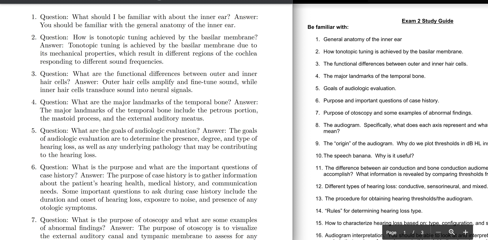

#Homework Answer Key Generator
Lazy-AI is a web app that uses Large Language Models (LLMs) to generate answer keys for homework problems. It takes a PDF of a homework assignment as input and returns a neatly formatted answer sheet that can be easily printed or saved.

## Features
- Generates answer keys for homework problems of arbitrary length and for any subject.
- Uses LLMs and NLP to generate natural language answers.
- Automatically formats and typesets the answer sheet.
- Can handle multiple input PDFs at once.
- Technologies Used
- The Homework Answer Key Generator is built using the following technologies:
## Installation
- Clone the repository:
    - `git clone https://github.com/yourusername/homework-answer-key-generator.git`
- Enter and install dependencies
    - `cd lazy-ai`
    - `conda env create lazy-ai`
    - `conda activate homework-answer-key-generator`
    - `pip install -r requirements.txt`

## TODO:
- Develop the frontend user interface using JavaScript and HTML.
- Integrate the backend and frontend to create a seamless user experience.
- Write tests to ensure that the application is functioning correctly.

